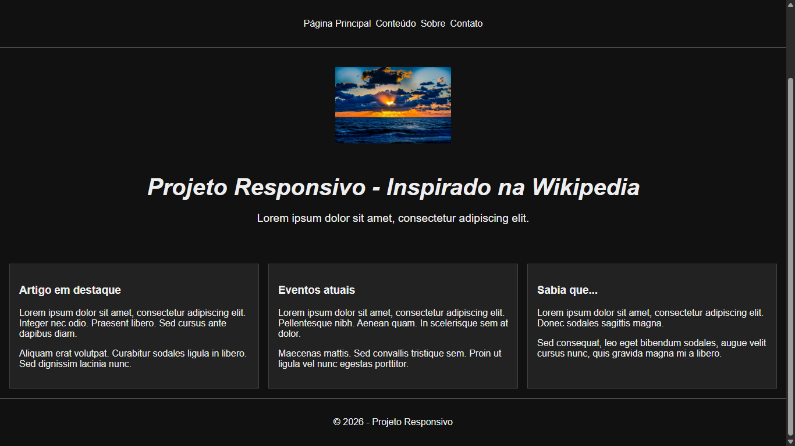
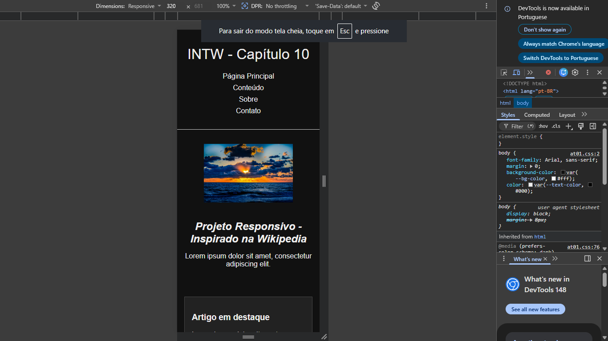

# Projeto - Recriação Responsiva

## Nome do Aluno
Jônatas Vinícius Oliveira Cardoso

## Site Escolhido
Wikipedia

## Link do Site Original
https://www.wikipedia.org

## Objetivo Visual do Projeto
Recriar de forma simplificada e responsiva a página inicial da Wikipedia.

## Tecnologias Utilizadas
- HTML5
- CSS3
- Flexbox
- CSS Grid
- Media Queries
- Função clamp()
- prefers-color-scheme (dark mode)

## Estratégia Responsiva Utilizada
Abordagem **mobile-first**, com layout inicial em coluna e adaptação progressiva para telas maiores utilizando Flexbox e Grid.

## Breakpoints Implementados
- 768px 
- 1024px 
- 1440px 

## Principais Dificuldades
- Ajustar a hero section para manter a imagem responsiva em diferentes tamanhos de tela.
- Organizar os cards em grid sem perder legibilidade.
- Garantir que o dark mode mantivesse contraste adequado.

## Principais Adaptações Realizadas
- Substituição do globo estilizado da Wikipedia por uma imagem de pôr do sol.
- Simplificação da navegação e dos blocos de conteúdo.
- Uso de tipografia fluida com clamp().
- Implementação de dark mode automático.

## Capturas de Tela do Projeto

### Versão Desktop

### Versão Mobile

